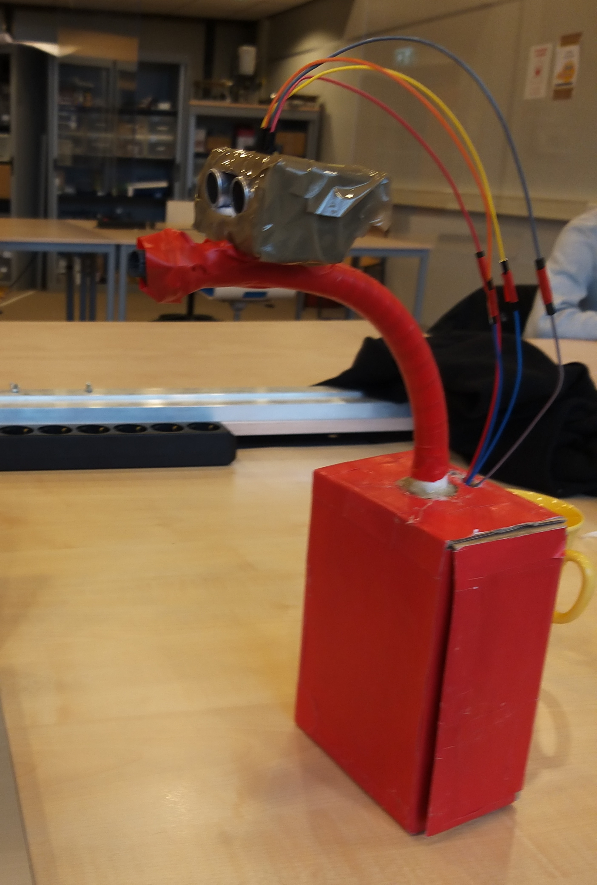

# CoroneX User Guide

This is CoroneX safety system which includes everything you wanted for your health.

<div align="center">

<p>Our pretty CoroneX-bot/boy</p>
</div>


## Navigation Bar
* [What is this exactly?](#what-is-this-exactly)
* [Features](#features)
* [How To Initialize CoroneX](#how-to-initialize-coronex)
* [References](#references)
* [Additional Notes](#additional-notes)

## What is this exactly
> More measurement is needed against corona and it should be automatized

CoroneX is a control mechanism which is mostly designed for entrances of commonly used closed spaces.

It maintains the safety by mainly checking temperature and people counting.

In addition to that, CoroneX comes with environmental air quality, humidity and temperature sensors.

Client themselves can choose appropriate lowerbounds and upperbounds for these features. And in outside of these bounds, your security staff will get warned by e-mail system. 

A video to give you an idea about CoroneX: https://youtu.be/DwOEBgt9jCc

## Features
**on Wemos D1 Mini:**
- Wemos SHT30 Humidity and Temperature Shell: https://www.wemos.cc/en/latest/d1_mini_shield/sht30.html
- CCS811 Air Quality Sensor: https://cdn.sparkfun.com/assets/learn_tutorials/1/4/3/CCS811_Datasheet-DS000459.pdf
---
**on Arduino Uno:**
- MLX90614 Infra-red Thermometer: https://www.melexis.com/en/product/mlx90614/digital-plug-play-infrared-thermometer-to-can
- HC-SR04 Distance sensor: http://web.eece.maine.edu/~zhu/book/lab/HC-SR04%20User%20Manual.pdf
---
**on Your Device:**
- Any web camera connected or IP camera (We used Raspberry Camera Module: https://www.raspberrypi.org/documentation/usage/camera/)

## How To Initialize CoroneX
Setup your device: (For us it was Raspberry Pi 4 and preferably a LINUX distro)

- According to your device, you will probably need I2C, GPIO, SerialPort configs. Be ready for much more necessary library and configurations on your system. There was a pile of solved issues for us in 14 weeks that took our noticable effort...
- on your device download Arduino IDE

Now, we set up Arduino Uno first:
- In board manager choose, Arduino Uno configurations.
- Import necessary libraries from library manager in Arduino IDE that is related with mlx-thermometer.ino.
- Connect the cables of MLX and HC-SR04 to Uno properly.
- Connect your Uno to USB port of your device. Upload mlx-thermometer.ino to your Arduino Uno and it's done!

(Optional) Secondly, we set up WEMOS D1 Mini:
- In Arduino IDE's preferences add: https://arduino.esp8266.com/stable/package_esp8266com_index.json
- In board manager choose, WEMOS D1 Mini & R2... configurations
- Import necessary libraries from library manager in Arduino IDE that is related with HealthyRoom.ino.
- Don't forget to change variables ssid to your Wi-Fi's ssid and password to your Wi-Fi's password. Be sure that WEMOS and your device is connected to the same network.
- Connect the cables of CCS811 and SHT30 to WEMOS properly.
- Connect your WEMOS to USB port of your device. Upload HealthyRoom.ino to your WEMOS and it's done!

Now, back to our device:
- Install Python 3.7
- with pip3 install, install requirements you will find in /python_code/People-Counting-in-Real-Time-master/requirements.txt
- Run CoroneX.py via your editor or using bash:
```
	python3 CoroneX.py
```
- Enter all your credentials and submit them! It is pretty straight-forward process(YOUR PROGRAM WILL CRASH IN ILLEGAL CASES, IF YOUR CREDENTIALS ARE WRONG!)
- It will initialize the example testing video, if there are no URLs entered.
- In case of library non-existance raises, we are sorry to be not mentioned it about requirements.txt. 


## References
People tracking and counting mainly implemented by using this repository.
```
	https://github.com/saimj7/People-Counting-in-Real-Time.git
```
You can find his references in his page also in "python_code" folder that contains altered version of his project.


## Additional Notes

- Some sort of files is unnecessary for this project. We couldn't find a time to clean all of them. You can easily distinguish the relatable codes and files from unrelated ones.


[Back to navigation bar](#navigation-bar)